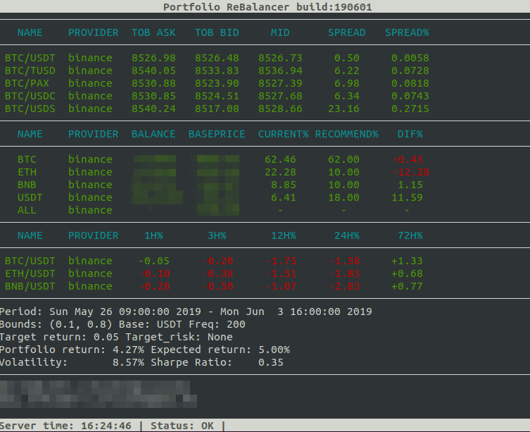

# Portfolio Rebalancer

If you are an investor in any kind of trading instruments you are likely always looking for ways 
to increase your return or lower your risk, 
and it turns out there is a way to do both simultaneously called rebalancing. 
Portfolio rebalancing is something every investor should either do themselves or have done for them.

Timely and consistent rebalancing has become a cornerstone of modern portfolio theory. 
Rebalancing can magnify returns by promoting selling high and buying low, 
and reduce long-term risk by ensuring the portfolio adheres to its designated risk tolerance. 
The keys are to rebalance in a timely manner and to do it consistently because the benefits 
of rebalancing compound over time - but rebalancing by hand is a pain, 
and that can lead to inconsistency. 
I pursued this project due to the lack of free tools to simply rebalance an existing portfolio.

My portfolio is spread across various accounts and asset classes, 
so at a minimum this portfolio rebalancer had to consider how to best allocate assets within 
and across accounts. If new assets were added to the portfolio (based on the target portfolio definition)
the rebalancer must also handle distributing those new assets into an existing account 
with adequate funds for it.

A huge shoutout and thanks to the team behind [ccxt](https://github.com/ccxt/ccxt) and 
[PyPortfolioOpt](https://github.com/robertmartin8/PyPortfolioOpt).

It is free to use and modify for your own strategies and api wrappers.

## Getting Started

1. Pull repository from git
2. python -m pip install requirements
3. cp _setings.py settings.py
4. Modify your settings
4. Run it in various ways:
    * Simple run it with python run.py 
    * Use start.sh script to automatically run new tmux session with script

## Operation Overview

This rebalancer works on the following principles:

* Main loop run exchange clients.
* On each step we fetch all_tickers if available or exact tickers from tickers_list.
* Then we get OHLCV data for portfolio markets.
* Fetch Balances and calculate current weights.
* Based on parameters set by the user we generate optimized portfolio.
* Converge recommended weights with current portfolio weights.
* Generate a descriptions of orders we would like to place.
* Trade it with right account and provider.
* Cancel unfilled orders.
* Check settings file and reload on changes.
    
## Simplified Output

The following is some of what you can expect when running this program:

 

## Roadmap

- [ ] All base asset support
- [ ] All assets portfolio
- [ ] Database reporting on trades
- [ ] Separate bounds for each asset.
- [ ] Multiple accounts on same exchange.
- [ ] Processing multiple time frame ohlcv data.
- [ ] Order manager with more trading behaviour.
- [ ] Add more exchanges.
- [ ] Plotting the efficient frontier.
- [ ] More optimisation goals

## Troubleshooting

Common errors had seen:

## Compatibility

This module supports Python 3.7 and later.