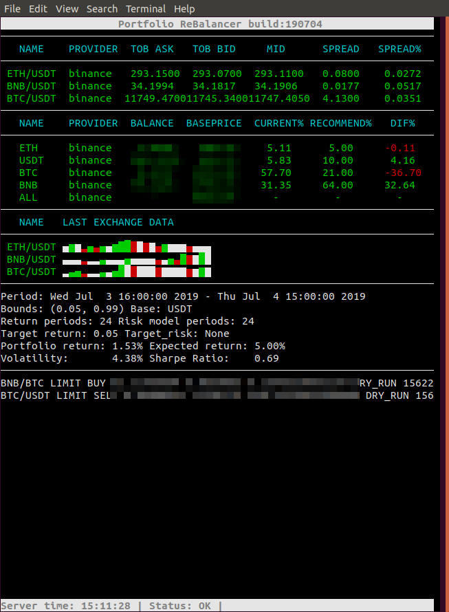

# Portfolio Rebalancer

If you are an investor in any kind of trading instruments you are likely always looking for ways 
to increase your return or lower your risk, 
and it turns out there is a way to do both simultaneously called rebalancing. 
Portfolio rebalancing is something every investor should either do themselves or have done for them.

Timely and consistent rebalancing has become a cornerstone of modern portfolio theory. 
Rebalancing can magnify returns by promoting selling high and buying low, 
and reduce long-term risk by ensuring the portfolio adheres to its designated risk tolerance. 
The keys are to rebalance in a timely manner and to do it consistently because the benefits 
of rebalancing compound over time - but rebalancing by hand is a pain, 
and that can lead to inconsistency. 
I pursued this project due to the lack of free tools to simply rebalance an existing portfolio.

If your portfolio is spread across various accounts and asset classes, 
so at a minimum this portfolio rebalancer had to consider how to best allocate assets within 
and across accounts. If new assets were added to the portfolio (based on the target portfolio definition)
the rebalancer must also handle distributing those new assets into an existing account 
with adequate funds for it.

Rebalancer is a free and open source crypto trading bot written in Python. 
It is designed to support all major exchanges and be controlled via settings file, db, *telegram. 
It contains *backtesting, plotting and money management tools as well as 
portfolio optimization by machine learning.

A huge shoutout and thanks to the team behind [ccxt](https://github.com/ccxt/ccxt) and 
[PyPortfolioOpt](https://github.com/robertmartin8/PyPortfolioOpt).

It is free to use and modify for your own strategies and api wrappers.

## Disclaimer

This software is for educational purposes only. Do not risk money which
you are afraid to lose. USE THE SOFTWARE AT YOUR OWN RISK. THE AUTHORS
AND ALL AFFILIATES ASSUME NO RESPONSIBILITY FOR YOUR TRADING RESULTS.

Always start by running a trading bot in Dry-run and do not engage money
before you understand how it works and what profit/loss you should
expect.

We strongly recommend you to have coding and Python knowledge. Do not
hesitate to read the source code and understand the mechanism of this bot.


## Getting Started

```bash
git clone git@bitbucket.org:Nekrasovp/yat-rebalancer.git
cd yat-rebalancer
python -m pip install requirements
cp _setings.py settings.py
```
Modify your settings according to the following [Configuration guideline](docs/Configuration.md) 
and run it in various ways:
```bash
python run.py
```
or run new tmux session with script and settings file in nano
```bash
sh start.sh
```

For any other type of installation please refer to [Installation doc](docs/Installation.md).


## Operation Overview

This bot works on the following principles:

* Main loop run exchange clients.
* On each step we fetch all_tickers if available or exact tickers from tickers_list.
* Then we get OHLCV data for portfolio markets.
* Fetch Balances and calculate current weights.
* Based on parameters set by the user we generate optimized portfolio.
* Converge recommended weights with current portfolio weights.
* Generate a descriptions of orders we would like to place.
* Trade it with right account and provider.
* Report on succeed orders.
* Cancel unfilled orders before generating new recommendations and orders.
* Check settings file or db and reload on changes.
    
## Simplified Output

The following is some of what you can expect when running this program:

 


## Roadmap and features

- [x] Based on Python 3.7+: For operating on any operating system - Windows, macOS and Linux.
- [x] Dry-run support to run the bot without playing money.
- [x] Simple curses gui which works with console, tmux, a ANSI terminal, a Telnet or SSH client

         + Header bar
         + Footer bar
         + Simple table printing with colouring
         + Table header printing
         + Spark lines with built-in normalization of data
         + TextWidget
         + Mouse support
         - Add curses panels to get more interactive ui

- [x] Support for assets with direct trade market available
- [x] 2-leg market data for markets without direct trade to base asset     
- [x] Settings watcher check file changes to reload the bot(let you control settings with other scripts)
- [ ] Persistence is achieved through db communication.
        
        + Database reporting on trades
        - Report on ohlcv refresh and recomendations calculating
        - Settings watcher check db for settings change
        - Check db on start for previous state on reboot
        
- [x] Optimisation goals for portfolio
        
        + 'Markowitz portfolio', minimising volatility for a given target_return
        + Sharpe-maximising portfolio for a given volatility(max return for a target_risk)
        + Minimise volatility
        + Maximise the Sharpe Ratio
        + Processing multiple time frame ohlcv data to define more parameters for optimization.
        - Design Custom EfficientFrontier.BaseOptimizer.ScipyOptimizer with new weight_bounds generation behaviour
        
- [ ] Separate bounds for each asset.
- [ ] Order manager with more trading behaviour(trailing stop loss, defined either the trader or settings)
- [x] Whitelist assets you want to trade.
- [x] Blacklist assets you want to avoid.
- [ ] Dynamic white lists by Volume, etc.
- [ ] Plotting the efficient frontier.
- [ ] Manage the bot with Telegram.
        
        - Display your profit/loss in fiat.
        - Provide a daily summary of your profit/loss.
        - Provide a performance status of your current trades.

- [ ] Market state optimization by machine learning to optimize your bot parameters.

## Roadmap
### Setup: 
- Base_asset, market_depth_position_count
### Portfolio: 
- Ticker, position, cost, lob(tob), 24h volume
- Optimization recommendation
- Optimized order agregator
### Market Depth:
- LOB(Central or centered)
- Last, Position, Cost
### Limit Ladder Orderbook(Trader)
- Last, Position, VWAP
### Order Container
- Feeded from Trader
- Asset, Volume, Price
- Market order
- Limit order
- Swipe order
- <arketable limit order(submit order at price higher(lower) than the current ask(bid) price
### Trader
- Return an offset for current volume[desired for swipe order]
- Set desired offset value(0.0)
### Trade blotter
STILL ACTIVE
- Live
- Partial
UNACTIVE
- Filled
- Cancelled
### Transaction log
- Trader, tick, asset, price sum, quantity
### Kill all orders
### Charting
- OHLCV charts
### Portfolio Optimization
### Average trading volume screen


## Exchange marketplaces supported
- [x] [Binance](https://www.binance.com/)
- [ ] [Kucoin](https://www.kucoin.com/)
- [ ] [100+ others to tests](https://github.com/ccxt/ccxt/). _(We cannot guarantee they will work)_


## Troubleshooting

Common errors had seen:

While we use Sequential Least SQuares Programming (SLSQP) for optimization, 
we have unexpected behaviour when we use small amount of data(less then 4 time periods).
Problems also happens when you use unconsistent data with big differences and small amount of periods.
Read more [here](https://github.com/scipy/scipy/issues/7519)


## Compatibility

This module supports Python 3.7 and later.